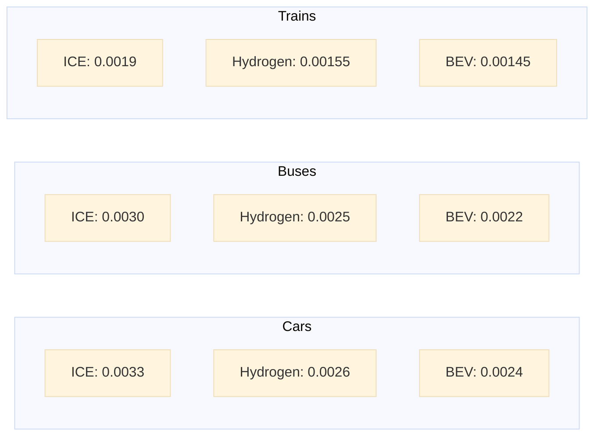

```mermaid
%%{init: {'theme': 'base'}}%%
graph LR
    subgraph Cars["Cars"]
        C1["ICE: 0.0033"]
        C2["Hydrogen: 0.0026"]
        C3["BEV: 0.0024"]
    end
    subgraph Buses["Buses"]
        B1["ICE: 0.0030"]
        B2["Hydrogen: 0.0025"]
        B3["BEV: 0.0022"]
    end
    subgraph Trains["Trains"]
        T1["ICE: 0.0019"]
        T2["Hydrogen: 0.00155"]
        T3["BEV: 0.00145"]
    end
```
