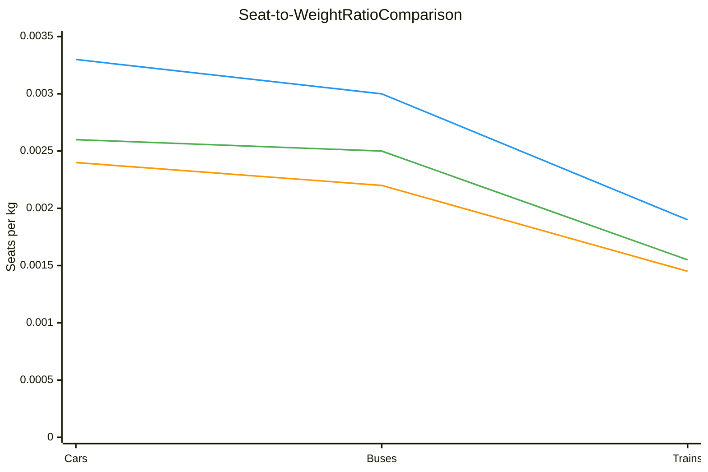

```mermaid
---
config:
  xyChart:
    width: 900
    height: 600
  themeVariables:
    xyChart:
      plotColorPalette: "#2196F3, #4CAF50, #FF9800"
---
xychart-beta
    title Seat-to-Weight Ratio Comparison
    x-axis [Cars, Buses, Trains]
    y-axis "Seats per kg" 0 --> 0.0035
    line [0.0033, 0.0030, 0.0019]
    line [0.0026, 0.0025, 0.00155]
    line [0.0024, 0.0022, 0.00145]
```
